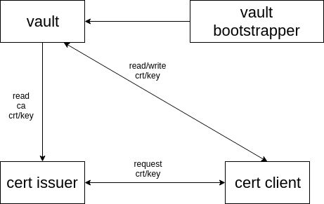

# Vault Demo project



### Example 1

Run vault server
```
$ vault server -dev
==> Vault server configuration:

             Api Address: http://127.0.0.1:8200
                     Cgo: disabled
         Cluster Address: https://127.0.0.1:8201
              Listener 1: tcp (addr: "127.0.0.1:8200", cluster address: "127.0.0.1:8201", tls: "disabled")
               Log Level: info
                   Mlock: supported: true, enabled: false
                 Storage: inmem
                 Version: Vault v0.10.0
             Version Sha: 5dd7f25f5c4b541f2da62d70075b6f82771a650d

WARNING! dev mode is enabled! In this mode, Vault runs entirely in-memory
and starts unsealed with a single unseal key. The root token is already
authenticated to the CLI, so you can immediately begin using Vault.

You may need to set the following environment variable:

    $ export VAULT_ADDR='http://127.0.0.1:8200'

The unseal key and root token are displayed below in case you want to
seal/unseal the Vault or re-authenticate.

Unseal Key: K3qFP15DnwzgnSxgcI4wEkDQSG8wbbJQyklTuhafIHQ=
Root Token: b6e1ec8f-4309-c875-8143-cfffd6051546

```

Open another terminal and run following command 
```
$ export VAULT_ADDR='http://127.0.0.1:8200'

```


Using K/v version 1 (unversioned key value pair)

```
# by default secret/ is versionsed K/V
$ vault secrets disable secret/
Success! Disabled the secrets engine (if it existed) at: secret/

$ vault secrets enable -version=1 -path=secret kv
Success! Enabled the kv secrets engine at: secret/
```

For K/V version 2 (versioned key value pair) [link](https://www.vaultproject.io/api/secret/kv/kv-v2.html)

Run vault-bootstrapper

```
$ vault-bootstrapper run \
        --dev \
        --vault-addr=http://127.0.0.1:8200 \
        --token=b6e1ec8f-4309-c875-8143-cfffd6051546 \
        --ca-cert-file=/home/ac/go/src/github.com/nightfury1204/vault-prac/vault-bootstrapper/dist/certs/ca.crt \
        --ca-key-file=/home/ac/go/src/github.com/nightfury1204/vault-prac/vault-bootstrapper/dist/certs/ca.key
    
Token for cert-issuer : 320c4971-18ff-9be4-9734-fe892d367427

```

Run cert issuer

```
$ cert-issuer run \
       --token=320c4971-18ff-9be4-9734-fe892d367427 \
       --vault-addr=http://127.0.0.1:8200 
       
Cert issuer server address: 127.0.0.1:10088       
```

Run cert client

```
cert-client run \
     --token=b6e1ec8f-4309-c875-8143-cfffd6051546 \
     --vault-addr=http://127.0.0.1:8200 \
     --vault-cert-path=secret/my-client-cert1 \
     --cert-issuer-addr=127.0.0.1:10088 \
     --org=phantom-troupe \
     --cn=phantom14
Getting crt/key is successful

```